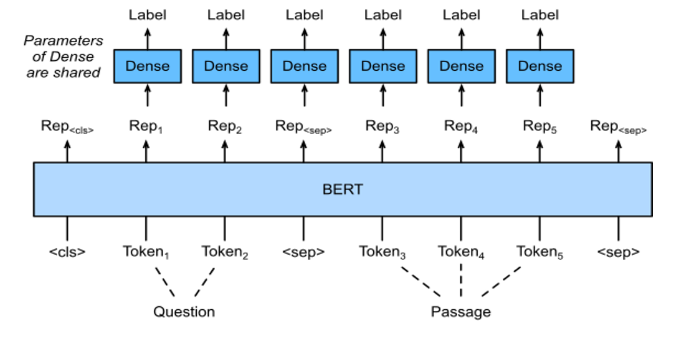

# Multi-span Question Answering
## Problem Description
Given a question and a context paragraph, we must find the **multiple discrete spans** in the paragraph to answer the question.
E.g:

## Approach
Model the problem as a Sequence Tagging Problem with BIO tags:
- B: First token of the answer span
- I: Token inside of the answer span
- O: Token outside of the answer span

Architecture (Label is either B, I, or O)
